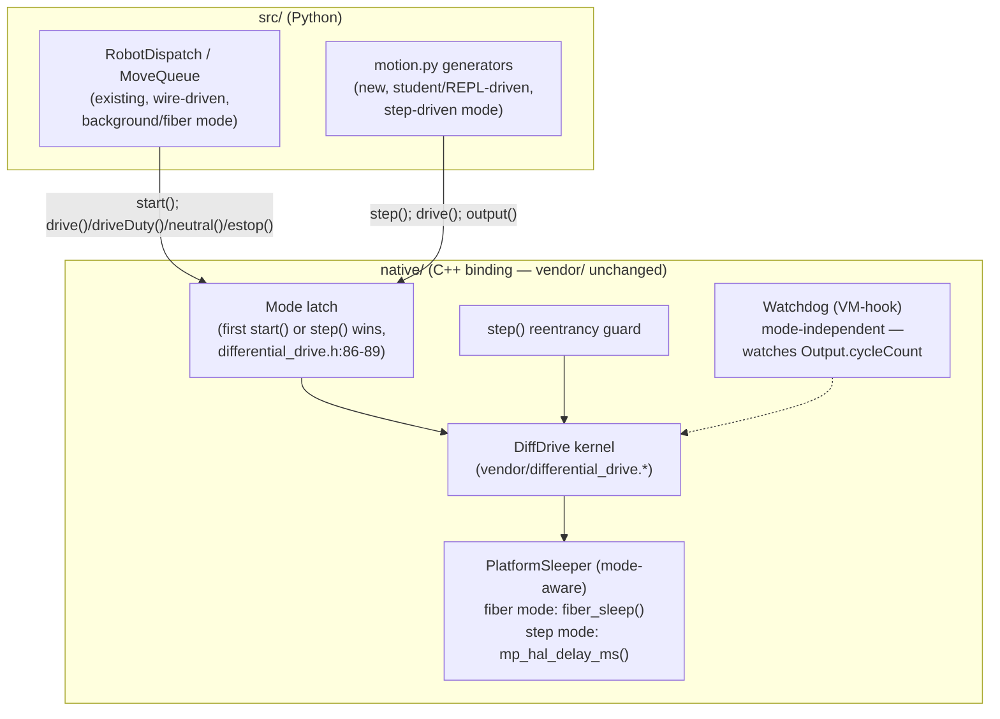

<!-- CLASI: Before changing code or making plans, review the SE process in CLAUDE.md -->

# Sprint 006: Comment condensation, main.py rename, generator control loop

## Goals

Land three related but independently-scoped issues in one sprint: (1)
reduce the codebase's comment-to-code ratio across `src/`, `native/`,
`tests/`, and `patches/` without changing behavior; (2) rename the
on-device entry point from `src/main_zetuv_demo.py` to `src/main.py` to
match what it actually is; (3) add a second, additive execution mode to
the DiffDrive control loop — Python generators driving `step()` directly
— alongside the existing background/fiber mode, per the
stakeholder-approved issue text.

## Problem

- Comments crowd out code: 3567 of 11201 lines (32%) across `src/`,
  `native/`, `tests/`, and `patches/` are comment/docstring lines; the
  worst files run close to 2:1 comment-to-code, headlined by
  `src/main_zetuv_demo.py`'s module docstring, which runs past line 70
  before the first import.
- The on-device entry point's repo name (`src/main_zetuv_demo.py`) no
  longer matches its deployed identity (`main.py`) or its actual
  robot-agnostic role, and the mismatch invites reference drift
  (`manifest.py`, `test_manifest_freeze.py`, `demo_square.py` all
  reference it by the old name).
- The background execution mode is cooperative-only: the kernel fiber
  only advances when Python reaches `microbit_hal_idle()`, so the
  realistic student idiom `while True: p = radio.receive()` starves it
  **routinely** (spec §7.2); the only mitigation today is the
  zero-only watchdog — a safety backstop, not a cadence guarantee.

## Solution

- Sweep comments across four areas — the rename lands first so no
  condensation pass fights an unsequenced rewrite of the same file's
  docstring; then `src/` (split in two for reviewability), `native/`,
  then `tests/`+`patches/` — preserving landmine markers, unit/frame
  convention notes, and short docstrings; deleting narrative history,
  provenance prose, and restated-next-line comments. No behavior
  change; offline-verified (`uv run pytest` stays green, unchanged).
- `git mv src/main_zetuv_demo.py src/main.py`, then update every
  reference (`manifest.py`, `test_manifest_freeze.py`'s
  `_BENCH_ONLY_MODULES`, `demo_square.py`, the file's own docstring),
  preserving the hard constraint that `main.py` never enters
  `manifest.py`'s freeze list (`mp_main()` probes the device
  *filesystem* for `main.py`; a frozen module named `main` would never
  be found).
- Add step-driven control to the native `diffdrive` binding (bind
  `step()`, a `start()`/`step()` mode latch, a mode-aware `Sleeper`, a
  reentrancy guard, a read-only `cyclePeriod`) and a generator-based
  move surface in `motion.py`, offline-tested against a fake diffdrive
  stub; document the student-facing contract for both modes; verify on
  the bench once the target robot's identity is confirmed.

## Success Criteria

- `uv run pytest` (223 passed / 518 subtests baseline) stays green,
  unchanged, after every comment-condensation and rename ticket.
- `src/main.py` exists, `src/main_zetuv_demo.py` does not;
  `manifest.py`'s freeze list still excludes it
  (`test_manifest_freeze.py`'s `_BENCH_ONLY_MODULES` guard updated to
  `"main.py"`, not removed); the module-listing test stays green.
- `./build.sh --clean --with-diffdrive` links with `step` in the
  `diffdrive` method table; `git diff --exit-code -- vendor/` stays
  clean.
- Generator-mode move logic in `motion.py` is offline-tested (pacing,
  lease renewal, `finally`-block stop, break semantics) against a fake
  diffdrive stub, mirroring the `comms.py` interface-seam pattern
  sprint 001 ticket 005 established.
- Background/fiber mode is provably unchanged — the existing
  `MoveQueue`/`RobotDispatch` tests pass unmodified.
- The bench leg (ticket 009) confirms on-device identity before
  applying any calibration, and demonstrates encoder-sign-correct
  step-driven drive, a break-mid-move stop, and an abandoned-generator
  watchdog zero — its execution is gated on the stakeholder resolving
  which robot is the target, not on this sprint's other tickets.

## Scope

### In Scope

- Comment condensation across `src/`, `native/`, `tests/`,
  `patches/*.py` (excluding raw `.patch` diff hunks — see Design
  Rationale).
- The `main.py` rename and every reference to it.
- Native binding additions for step-driven mode (`diffdrive.step`,
  mode latch, mode-aware `Sleeper`, reentrancy guard, `cyclePeriod`).
- `motion.py` generator-based move functions, offline-tested.
- Student-facing API contract documentation for both modes;
  `docs/design/specification.md` §10 open item 4 update.
- The generator-mode hardware bench leg, with the target robot as a
  parameter and an on-device identity check as its first step.

### Out of Scope

- Any `vendor/` edit (the sync-diff-clean gate stands).
- Any change to fiber-mode (background mode) behavior — it remains the
  explicit-`start()` path, unchanged.
- `reference/` material (copied from elsewhere; left alone).
- `config/devices.json` refresh from live enumeration — real and worth
  doing (ports churn on replug, UID-to-chassis mapping is unverified),
  but touches none of this sprint's three issues; filed separately as
  `robot-identity-collision-and-stale-device-map.md`.
- `data/active_robot.json`'s stale `data/robots/tovez.json` path (the
  actual file lives at `data/tovez.json`) — same reasoning; no ticket
  here touches config loading, since ticket 009 identifies its target
  from the device's own `robot.json`, not from `active_robot.json`.
  Flagged for a separate issue.
- `tlm-stream-ignores-tlm-off.md` — filed separately; ticket 009's
  bench-procedure text carries one line warning bench operators about
  the known TLM-flood-blocks-REPL-handshake defect, but fixing it is
  not this sprint's work.
- Any board other than the bench-confirmed target for ticket 009;
  `getez`/`zavaz` are relays, never touched.

## Test Strategy

Offline first, always: `uv run pytest` (223 passed / 518 subtests
baseline; `tests/test_build_gate.py` excluded from that baseline since
it needs a prior `./build.sh --clean`) after every comment-condensation
and rename ticket, asserting zero behavior change. `py_compile` +
`mpy-cross` lint every changed `src/*.py`. The native binding ticket
adds a build gate: `./build.sh --clean --with-diffdrive` must link with
`step` in the method table and leave `vendor/` sync-diff-clean. The
`motion.py` generator ticket adds CPython unit tests against a fake
diffdrive stub (interface-seam pattern, matching sprint 001 ticket
005's `comms.py` precedent) covering pacing, lease renewal, the
`finally`-block neutral, and break semantics. Hardware verification is
isolated to ticket 009 alone, sequenced last, and explicitly gated on
the stakeholder resolving target-robot identity — no other ticket in
this sprint touches hardware.

## Architecture

**Sizing: Substantial.** Driven by the generator-control-loop issue:
it adds a new execution mode to the native `diffdrive` binding (a
`start()`/`step()` mode latch, a mode-aware `Sleeper`, a reentrancy
guard) and a new generator-based surface in `motion.py` alongside the
existing background-mode consumer (`MoveQueue`/`RobotDispatch`) — a
structural change to the native↔Python contract, not a same-module
tweak. The comment-condensation and rename issues are trivial/
mechanical on their own (comments-only; one `git mv`) and get
lightweight treatment within this same section rather than separate
sizing.

### Architecture Overview

**Unchanged:** the vendored `DiffDrive` kernel
(`vendor/differential_drive.{h,cpp}`) and its four ports (`Clock`,
`Sleeper`, `FiberLauncher`, `Motor`) — no `vendor/` edit in this
sprint. The existing background-mode path (`RobotDispatch`/
`MoveQueue` in `motion.py` → `diffdrive.start()`/`drive()`/`driveDuty()`
→ kernel fiber) is untouched.

**New:** a step-driven mode that lets Python drive the kernel inline,
one cycle per `step()` call, from the *main* execution context (no
fiber, no fiber switch) instead of the kernel's own CODAL fiber. Both
modes share the same kernel instance and the same VM-hook starvation
watchdog; they differ only in who calls `step()` and how the
`Sleeper` port paces/settles.

**Module-level changes:**

- `native/moddiffdrive.cpp` + `native/moddiffdrive_glue.c` — bind
  `step()` alongside the existing `configure/begin/start/drive/
  driveDuty/neutral/estop/output/lastError/cycleOverrunCount` surface;
  add the mode latch and the reentrancy guard (prior art:
  `reference/modrobot/modrobot.cpp`'s `inProgress` guard on
  `robot_v5_service()`).
- `native/platform_ports.{h,cpp}` — `PlatformSleeper` gains a
  mode flag (set once, at latch time, in `fiberEntry`) so
  `sleepMillis()`/`yield()` branch between `codal::fiber_sleep()`
  (fiber mode) and `mp_hal_delay_ms()` (step mode — this is what
  reaches `microbit_hal_idle()` so the comms pump keeps running during
  a settle).
- `src/motion.py` — new generator functions (illustrative shape per
  the issue: `drive(v, twist, duration_ms)` yielding `output()` each
  cycle, `finally: neutral(); step()` on exit) alongside the existing,
  **unchanged** `MoveQueue`/`RobotDispatch` background-mode classes.
  Absolute-deadline pacing against `cyclePeriod`; short lease (~3×
  period) renewed every cycle so an abandoned generator decays on its
  own before the watchdog would ever need to act.
- `docs/design/specification.md` §10 open item 4 — record the
  mechanism decision (framework-owned cadence inside move generators,
  student-owned loop body — neither `on_tick()` nor raw student
  `while True:`); explicitly defer which mode is the *primary*
  teaching posture until ticket 009's hardware evidence.
- `src/main.py` (renamed) and the four comment-condensation areas —
  no interface or dependency change; existing modules keep their
  existing responsibilities and boundaries.

No entity-relationship diagram (no data-model change — `data/*.json`
schema is untouched) and no dependency-graph diagram beyond the one
component diagram above (the only new edge is `motion.py`'s generator
surface → `diffdrive.step()`/`cyclePeriod`, already shown).

### Design Rationale

**Decision: add step-driven mode as a new binding surface, not the
`step()` non-blocking-state-machine restructure spec §7.3 describes as
a "prepared exit."**
Context: `step()` blocks ~9–10 ms per call (two 4 ms encoder settles);
spec §7.3's SWI-based non-blocking restructure is a `vendor/` change,
explicitly contingent on M1 hardware evidence and owned by
radio-robot.
Alternatives considered: (a) do the SWI restructure now as part of
this sprint; (b) add step-driven mode as-is, blocking cost accepted.
Why this choice: it needs zero `vendor/` change — the kernel's own
`FiberLauncher` contract already declares step-driven-host composition
sanctioned (`differential_drive.h:18-20`, `:107-110`) — and the ~10 ms
block per `next()` is an accepted cost for a cooperative teaching mode
(the issue's own framing), paced against the 24 ms cycle.
Consequences: the SWI restructure remains open, decided independently
in radio-robot from M1 hardware evidence; this sprint forecloses
nothing there and does not need to wait on it.

**Decision: the mode latch is a hard mutual exclusion (first
`start()` or `step()` call wins, no runtime switch), not a per-call
mode parameter.**
Context: `start()` is irreversible — no `stop()` exists and `run()`
never returns; the vendored kernel was never designed for concurrent
access from two callers.
Alternatives considered: (a) allow interleaving `step()` calls even
after `start()`; (b) a hard latch.
Why this choice: interleaving would race the kernel fiber and a
step-driven caller over the same kernel state with no synchronization
primitive between them. A hard latch matches the documented
`FiberLauncher` contract and needs no new concurrency primitive.
Consequences: a boot is background-mode-for-life or
generator-mode-for-life; this is stated explicitly in the
student-facing contract (ticket 008), not left implicit.

**Decision: mode-aware `Sleeper` via a runtime flag, not two `Sleeper`
subclasses.**
Context: `DiffDrive::Sleeper` is injected once at kernel construction;
its concrete instance can't be swapped after the fact without a wider
constructor change.
Alternatives considered: (a) one flag, set once at latch time; (b)
subclass/template dispatch chosen at construction time (before the
mode is even known).
Why this choice: the latch already provides the single natural place
to set the flag; (b) would require knowing the mode before it's
decided, which is a contradiction. A flag is the minimal-diff option,
consistent with the issue's own "small follow-on ticket" framing.
Consequences: `PlatformSleeper`'s two methods each branch on the flag
— a small, contained addition, not a new abstraction layer.

**Decision: comment-condensation split into 5 tickets by area (rename;
`src/` large-narrative files; `src/` remaining modules; `native/`;
`tests/`+`patches/`), not one sweep or one ticket per file.**
Context: ~3567 comment lines across 4 directories; the heaviest
concentration (~2300 lines) is in 14 `src/` files alone.
Alternatives considered: (a) one ticket for the whole sweep; (b) one
ticket per file; (c) grouped by area, `src/` further split for size.
Why this choice: one ticket is unreviewable at this line count;
per-file tickets are needless management overhead for genuinely
uniform mechanical work; area-grouping (with `src/` split into
"large-narrative" vs. "remaining modules" for balance — roughly 1171
vs. 1144+ comment lines) matches the issue's own suggested grouping
and keeps each ticket's diff reviewable.
Consequences: sequencing must prevent two condensation tickets — or a
condensation ticket and a functional ticket — from touching the same
file unsequenced; handled via `depends-on` (see Migration Concerns and
the Tickets table).

**Decision: `patches/*.patch` diff files are excluded from the
comment-condensation sweep.**
Context: `patches/modrobot_wire.patch` and `patches/yield.patch` are
raw diffs applied against vendored MicroPython source; a comment
inside a diff hunk is content that gets *applied elsewhere*, not a
same-repo prose simplification.
Alternatives considered: (a) sweep hunks too, since some contain
comments; (b) exclude `.patch` files, sweep only `patches/*.py`.
Why this choice: editing a hunk changes what the patch actually
applies downstream — a correctness risk, not a readability
improvement — and is out of this issue's own stated intent.
Consequences: `patches/apply_overlay.py`/`apply_yield.py` (plain
Python) are in scope; the two `.patch` files are not.

### Migration Concerns

- **None functionally.** Comment condensation and the rename are
  behavior-preserving by construction (the offline pytest gate
  enforces this on every ticket). The generator-mode addition is
  purely additive: the background-mode code path is untouched, so
  existing wire-driven or REPL background-mode usage needs no
  migration.
- **Sequencing risk, not data migration.** Tickets 001–005 touch
  nearly every file in `src/`, `native/`, `tests/` — the `depends-on`
  graph exists specifically to prevent two tickets producing
  conflicting, hard-to-review diffs against the same file (e.g.
  `main.py`'s docstring, `motion.py`, `test_motion.py`). Executing out
  of the stated dependency order risks merge conflicts, not data loss.
- **Freeze-point interaction.** `src/*.py` content changes (rename and
  comment condensation both) touch files frozen into the firmware
  image via `manifest.py` (spec §7.4). Any resulting flash-size
  movement is expected in the **smaller** direction (fewer bytes of
  frozen docstring) and is not a regression. `tests/
  test_manifest_freeze.py` itself carries no byte-size assertion
  (confirmed by reading it — only exact-module-listing and
  freeze-path-string checks); the size-sensitive gate, if a build is
  run, is `tests/test_build_gate.py::test_flash_end_below_fs_start`
  (fixed `_fs_start = 0x6D000` ceiling).
- **Target-robot ambiguity (ticket 009).** The bench is not currently
  in a state where any drive test can safely proceed without an
  explicit identity check. Two boards on the bench self-identify as
  `tovez` over the v5 cleartext protocol (`ID` → `ID:diffdrive:tovez:
  1.0.0`) and via on-device `robot.json`; zetuv's registered UID has
  never enumerated. `data/zetuv.json` (975 ticks/rev, 3.4484
  ticks/mm) and `data/tovez.json` (3600 ticks/rev, 12.7602 ticks/mm)
  differ by a factor of 3.70 — commit `6c5f57c`'s 3.3× driving error
  (500 mm commanded, ~150 mm actual) is exactly this class of
  mistake, compounded by a zetuv-titled commit message that actually
  edited `data/tovez.json`. Ticket 009 treats "on-device identity
  matches the config being applied" as a hard precondition and
  refuses to proceed on a mismatch, rather than assuming.

## Use Cases

### SUC-001: Student drives wheels via a generator-based move routine (step-driven mode)
Parent: UC-003

- **Actor**: Student
- **Preconditions**: UC-002 (flashed, REPL live); robot config loaded
  (UC-011); neither `start()` nor `step()` has been called yet this
  boot (mode not yet latched).
- **Main Flow**:
  1. Student iterates a `motion.py` generator function (e.g. `for
     state in motion.drive(v, twist, duration_ms): ...`).
  2. The first `next()` call latches step-driven mode (raises if
     `start()` was already called this boot).
  3. Each `next()` renews a short lease, calls `diffdrive.step()` (one
     kernel cycle inline, paced to `cyclePeriod` via absolute
     deadlines), and yields `diffdrive.output()`.
  4. The student's loop body runs between `next()` calls (~14 ms
     budget); wheels move only while the student keeps iterating.
  5. On normal completion or `break`, `GeneratorExit` triggers the
     generator's `finally` block: `neutral()` + one landing `step()`
     so the staged zero reaches the bus.
- **Postconditions**: wheels stop cleanly at generator exit; encoder
  counts advanced with correct signs while iterating;
  `cycleOverrunCount_` reflects any cadence loss.
- **Acceptance Criteria**:
  - [ ] Offline: fake-diffdrive-stub tests cover pacing, lease
        renewal, and the `finally`-block stop for both normal
        completion and `break` (ticket 007).
  - [ ] Hardware: encoder-sign-correct step-driven drive; a
        break-mid-move stop within one cycle (ticket 009).

### SUC-002: Abandoned generator decays to neutral / watchdog zero
Parent: UC-004

- **Actor**: Student (inadvertently)
- **Preconditions**: SUC-001 in progress (a move generator has been
  partially iterated).
- **Main Flow**:
  1. Student code stops calling `next()` on the generator without a
     clean `break` (an exception elsewhere, or the reference is
     simply dropped) — the lease commanded on the last `step()` was
     intentionally short (~3× cycle period).
  2. If iteration resumes within the lease window, motion continues
     normally.
  3. If not, the lease expires and the kernel zeroes duty on its own
     — the same mechanism as background mode's lease expiry (UC-003).
  4. If Python itself has stalled entirely (never reaching idle), the
     VM-hook starvation watchdog — mode-independent, keyed off
     `Output.cycleCount` — zeroes duty within ~250 ms, same as UC-004.
- **Postconditions**: wheels never run unattended past one lease
  window; the safety backstop is identical in shape to background
  mode's, not a new mechanism.
- **Acceptance Criteria**:
  - [ ] Hardware: an abandoned-generator drive is zeroed within
        ~250 ms (ticket 009).

Comment condensation and the rename carry no new use case —
non-behavioral by construction — but trace to existing use cases for
ticket coverage: UC-001 (build stays green) for the four
comment-condensation tickets, UC-002 (on-device `main.py` boot
mechanism) for the rename ticket.

## GitHub Issues

(None — this sprint's issues are CLASI-local `clasi/issues/` files:
`condense-comments-across-the-codebase.md`,
`rename-main-zetuv-demo-to-main.md`,
`generator-driven-control-loop-mode-addition-not-replacement.md`.)

## Definition of Ready

- [x] Sprint planning document is complete (sprint.md, including its
      Architecture and Use Cases sections)
- [x] Architecture review passed
- [x] Stakeholder has approved the sprint plan (plan approved as
      stated across two coordinator check-ins, 2026-08-20, including
      the target-robot-as-parameter and 5-way comment-condensation
      decisions)

## Tickets

| # | Title | Depends On |
|---|-------|------------|
| 001 | Rename src/main_zetuv_demo.py to src/main.py | — |
| 002 | Condense comments: src/ large narrative files (main.py, demo_square.py, boot.py, wire.py) | 001 |
| 003 | Condense comments: src/ remaining modules (config, msgs, line, otos, radio_shim, motion, telemetry, comms, wifi_at, demo_util) | — |
| 004 | Condense comments: native/ C++ files | — |
| 005 | Condense comments: tests/ and patches/*.py | 001 |
| 006 | Native binding: diffdrive.step(), mode latch, mode-aware Sleeper, reentrancy guard, cyclePeriod | 004 |
| 007 | motion.py generator-driven move logic (offline, fake-diffdrive stub) | 003, 005, 006 |
| 008 | Student-facing API contract docs (both modes) + specification.md open item 4 | 007 |
| 009 | Hardware bench leg: generator-mode drive, break-mid-move stop, abandoned-generator watchdog zero | 007, 008 |

Tickets execute serially in the order listed.
