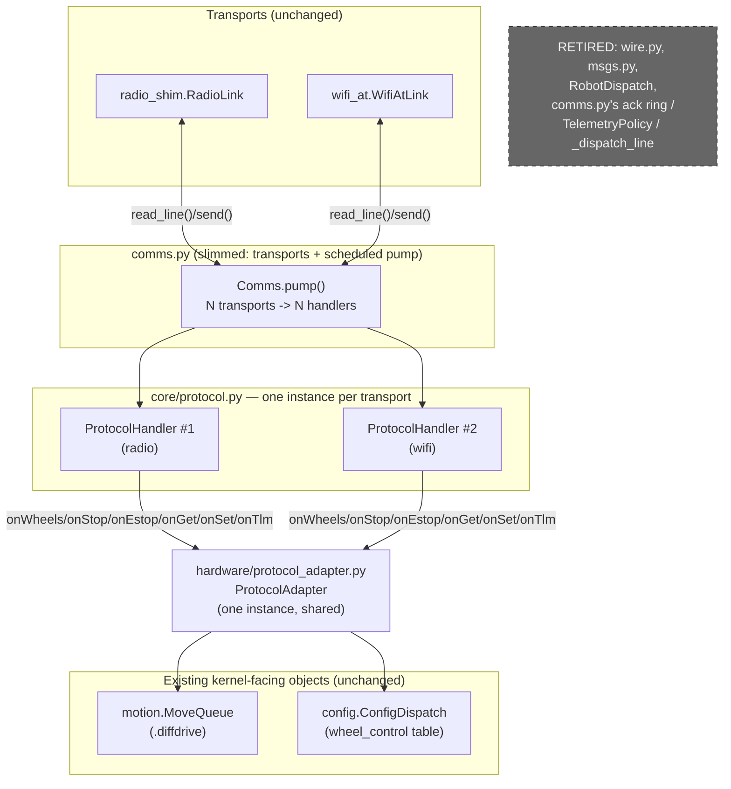

<!-- CLASI: Before changing code or making plans, review the SE process in CLAUDE.md -->

# Sprint 007: v6 line protocol cutover + WiFi bring-up on tovez

## Goals

Replace the v5 binary/COBS+CRC wire engine with the v6 ASCII line
protocol (`radio-robot-lib/docs/design/protocol.md`), hard cutover, no
dual-stack period on the device — and, in parallel, prove the WiFi
module's TCP-REPL-mirror + UDP-protocol-plane dual channel on real
hardware (tovez) for the first time. The two tracks join at the end:
the WiFi UDP plane starts carrying v6 traffic once both halves are
green.

## Problem

- The v5 engine (`src/core/wire.py`'s COBS+CRC framing, `src/core/
  msgs.py`'s verb registry, `comms.py`'s binary/cleartext dispatch,
  ack ring, ×3 repeats, telemetry emit-policy arithmetic) is being
  retired project-wide in favor of v6's ASCII space-grammar line
  protocol — a hard cutover, stakeholder decision 2026-08-21, so this
  firmware image must not carry both at once.
- `protocol.md`'s handler/adapter split (`radio-robot-lib/src/
  protocol/protocol_handler.{h,cpp}`) is a C++ archetype, explicitly
  built to be ported by reading it and running its own conformance
  fixture (`golden_vectors.txt`) — nothing in this repo does that yet.
- The WiFi half of the four-channel comms shape (USB REPL / radio /
  WiFi TCP REPL mirror / WiFi UDP protocol plane) is code-complete
  (`src/core/wifi_at.py`, 728 lines) but has **never run on hardware**
  — bench step A.7 has no log entry, and `tests/test_wifi_at.py` is
  mock-serial only.
- Once v5 retires, radio-robot's own v5 host tooling
  (`wifi_bench_gate.py`, `move_protocol_bench.py`, the rogo relay
  path) goes dark against this firmware until re-ported — an accepted
  consequence, but it means the WiFi bring-up track needs its own
  self-contained host prober in this repo, independent of that
  tooling.

## Solution

Two tracks, kept independent until a single join ticket at the end:

- **Track A — protocol port (offline, no hardware).** Port
  `protocol_handler.{h,cpp}` to `src/core/protocol.py` (grammar,
  feed()/line-reassembly, dispatch, reply formatting — the only module
  that ever touches a wire byte) and a new `src/hardware/
  protocol_adapter.py` (typed adapter backed by the same
  `motion.MoveQueue`/`config.ConfigDispatch` objects the retiring
  `motion.RobotDispatch` wrapped). Build the golden-vector CPython
  harness first, drive the port to green against it verb-family by
  verb-family, then perform the hard-cutover wiring (delete
  `wire.py`/`msgs.py`, slim `comms.py` to transport + scheduled-pump
  orchestration, delete `RobotDispatch`, update `boot.py`'s banner and
  wiring) as one deliberate ticket.
- **Track B — WiFi bring-up on tovez (hardware, stakeholder-assisted).**
  Build a self-contained, protocol-agnostic host prober
  (`tools/`, TCP REPL half + UDP round-trip half), then run the bench
  ladder on tovez: power-cycle the WiFi module, deploy, prove the TCP
  REPL mirror, then prove the UDP plane's peer-learning and dual-plane
  concurrency — all using raw/whatever-lines-are-live traffic, not
  v6-aware.
- **Join.** Once both tracks are green, wire `WifiAtLink` as a
  registered v6 transport and run an end-to-end smoke test over the
  UDP plane with a concurrent TCP REPL session held open.

## Success Criteria

- `python3 -m pytest tests/` green throughout, including every
  applicable vector in the copied `golden_vectors.txt` fixture driven
  through a CPython mock-adapter harness, an explicit embedded-NUL
  divergence test (Python REJECTS `PING\0extra`, opposite of the C++
  characterization bug — §9.4), and a hex-float-rejection pin test.
- `mpy-cross` compiles `src/core/protocol.py` and `src/hardware/
  protocol_adapter.py` cleanly.
- A byte-exact loopback test reproduces `protocol.md`'s own literal
  banner/`ok`/`err`/`id` examples through the real boot-assembled
  engine (fake diffdrive, real adapter).
- `git diff --exit-code -- vendor/` stays clean throughout (no
  vendored kernel edit).
- On tovez: TCP `:7654` reaches an interactive REPL, survives 5 min
  idle and concurrent UDP traffic; UDP round-trips with the robot
  learning the host peer from its first datagram, telemetry throttled
  ≥50 ms; USB REPL stays live throughout.
- Join: a v6 HELLO/PING/WHEELS/STOP/ESTOP round trip over the WiFi UDP
  plane succeeds with a TCP REPL session concurrently open; findings
  appended to a tovez bench log in `docs/`.

## Scope

### In Scope

- `src/core/protocol.py` — the v6 handler (grammar, `feed()`,
  tokenizer, dispatch, reply formatting, telemetry header/frame
  emission), verb scope per `protocol.md` §6: `HELLO PING ID VER
  STATUS HELP GET SET TLM WHEELS STOP ESTOP`.
- `src/hardware/protocol_adapter.py` — the v6 `Adapter`, backed by
  `motion.MoveQueue.diffdrive` (WHEELS/STOP/ESTOP) and
  `config.ConfigDispatch`'s `wheel_control` table exposed by name
  (GET/SET).
- Retiring: `src/core/wire.py`, `src/core/msgs.py`,
  `tests/unit/test_wire_golden_vectors.py`,
  `tests/fixtures/wire_golden_vectors.txt`; `comms.py`'s v5 dispatch
  order/ack ring/`TelemetryPolicy`/`DbgAction`/`SeedRequest`/`Status`
  formatting; `motion.RobotDispatch` and its `MOVE`/`GO_TO`/
  `CALIBRATE` handlers.
- `comms.py` slimmed to transport registration + scheduled-pump
  orchestration over one `protocol.ProtocolHandler` instance per
  transport; `boot.py`'s banner (`device NEZHA2 robot <name>
  <serial>`) and step-3 wiring.
- `tests/fixtures/protocol_golden_vectors.txt` (copied from
  `radio-robot-lib`) + the CPython harness that drives it.
- `tools/` — a self-contained TCP REPL prober and UDP round-trip
  prober, protocol-agnostic.
- WiFi bench bring-up on tovez: TCP REPL mirror, UDP plane, dual-plane
  concurrency, findings log.
- The join: v6 over WiFi UDP, end-to-end smoke.

### Out of Scope

- `MOVE`, `GOTO`, `SEED`, `CAL` — deferred verbs (`protocol.md` §6);
  `motion.MoveQueue`/`Move`/the generator-driven move mode stay
  **untouched**, including `go_to()`, even though nothing reaches it
  over the wire once `RobotDispatch` is deleted. Rebuilding a
  MOVE-capable, six-operation motion API is sprint 008's job (Task 2
  of this planning session; requires this sprint closed first).
  `WHEELS_X`/`MOVE_X`/`MOVE_V`/`GO_TO_R`/`GO_TO_W` are explicitly not
  this sprint's verbs.
  `native/modwifiuart.cpp`, `codal_app/wifi_uart_pipe.cpp`,
  `wifi_stdio_hook.cpp`, and `build.sh --with-wifi` — unchanged; the
  UARTE1 shim and TCP-REPL-mirror C plumbing are not touched by
  either track.
- `radio_shim.py` — unchanged; v6 rides the same fragment-reassembly
  transport (its multi-frame reassembly becomes structurally dormant
  for v6 traffic, since a 240-byte max line always fits inside one
  247-byte RAW250 frame, but the code needs no edit and stays
  correct).
- Re-porting radio-robot's own v5 host tooling (`wifi_bench_gate.py`,
  `move_protocol_bench.py`, the rogo relay path) to v6 — explicitly
  accepted as going dark by the issue; this repo's own `tools/`
  prober is the replacement instrument for this sprint's own gates,
  not a drop-in replacement for that tooling project-wide.
- Any config-storage or on-flash persistence work (`protocol.md` §7:
  "the library stores none" — GET/SET are pure delegation to whatever
  the adapter already holds in RAM).
- `data/tovez.json` schema changes — `wheels.ticks_per_mm` already
  supplies the `countsPerLength` geometry factor `protocol.md` §5
  needs; no new field.

## Test Strategy

Offline first, always: `python3 -m pytest tests/` after every Track A
ticket. `py_compile` + `mpy-cross` lint on every changed `src/*.py`.
The golden-vector harness (ticket 001) is the backbone of Track A's
own gate — every later handler ticket adds verb families and drives
more of the fixture green, culminating in ticket 004's full-fixture
pass. `src/hardware/protocol_adapter.py` is tested offline against a
fake `diffdrive`/`config` stub, mirroring the existing
`comms.py`/`motion.py` interface-seam convention (sprint 001 ticket
005's precedent). Ticket 007's loopback test exercises the real
boot-assembled path (real adapter, fake diffdrive) for a byte-exact
check against `protocol.md`'s own literal examples — the one offline
test that stands in for "does the wiring, not just the class, work."

Track B's tickets are hardware and stakeholder-assisted throughout;
each states its physical prerequisites explicitly (WiFi module
power-cycled first — AT state persists across nRF reflashes;
`wifi_secrets.json` present on the device filesystem; the 192.168.4.x
AP up and reachable from the bench Mac). Per this repo's own
verification convention, **no hardware ticket in this sprint starts
before every offline (Track A) ticket that has landed on the branch
at that point is green** — this is a standing precondition on tickets
009–011, not a `depends-on` edge, and does not force Track A to
finish first: ticket 008 (the prober itself) and the offline Track A
chain can proceed in any interleaving, since the prober is
protocol-agnostic and the bench session (009/010) is valid whether
`boot.py` currently assembles the pre-cutover v5 engine or the
post-cutover v6 one. Only the join ticket (011) requires both
tracks' final tickets already landed.

## Architecture

**Sizing: Substantial.** This sprint retires two modules
(`wire.py`/`msgs.py`), introduces two new ones (`core/protocol.py`,
`hardware/protocol_adapter.py`), removes a third (`motion.RobotDispatch`),
restructures a fourth (`comms.py`'s dispatch core, though its
transport/pump plumbing survives), and proves a fifth
(`wifi_at.py`) on hardware for the first time — 5 modules touched, a
new cross-module dependency (`protocol.py` → `protocol_adapter.py` →
`motion`/`config`, replacing the old `comms.py` → `motion.py` wire),
and a real behavior change in how `WHEELS` maps to the kernel (v5:
raw duty; v6: velocity through `countsPerLength`). Every one of the
three "substantial" signals is present; this is not a borderline call.

### Architecture Overview

**Unchanged:** the vendored `DiffDrive` kernel and its ports; the
transport contract (`read_line()`/`send()`/`send_reliable()`);
`radio_shim.RadioLink`'s fragment reassembly; `wifi_at.WifiAtLink`'s
AT state machine, TCP demux, and UDP peer-learning; `boot.py`'s
six-step shape (only its banner string and step-3 wiring change);
`motion.MoveQueue`/`Move`/the generator-driven move mode.

**New:** `src/core/protocol.py` (the only module that ever touches a
wire byte — grammar, `feed()`, tokenizer, dispatch, reply formatting,
telemetry emission) and `src/hardware/protocol_adapter.py` (the typed
`Adapter`, translating `onWheels`/`onStop`/`onEstop`/`onGet`/`onSet`/
`onTlm`/`identity`/`now`/`status` calls into `MoveQueue.diffdrive` and
`ConfigDispatch`'s `wheel_control` table). `comms.py` is slimmed to
transport registration and the scheduled-pump loop, now driving **one
`protocol.ProtocolHandler` instance per registered transport** (see
Design Rationale) rather than its old single `_dispatch_line()`
switch. `motion.RobotDispatch` and its `MOVE`/`GO_TO`/`CALIBRATE`
handlers are deleted (the v5-wire-shaped binary dispatch they existed
for no longer has a caller).

No entity-relationship diagram — no persistent data-model change
(`data/*.json` schema untouched; `wheels.ticks_per_mm` already
supplies `countsPerLength`). No separate dependency graph — every new
edge is already shown above, and none of them cycle: dependency flows
`Transports -> comms.py -> protocol.py -> protocol_adapter.py ->
motion.py/config.py`, consistent with this repo's existing
core-then-hardware direction (`core/protocol.py` has zero import on
`hardware/`; only `hardware/protocol_adapter.py` depends on `core/`).

**Track B (WiFi bring-up) introduces no new source module** — it
proves existing, unchanged code (`wifi_at.py`) on hardware, plus a new
**host-side, decoupled** `tools/` prober that talks to the robot only
over its TCP/UDP sockets, with zero import dependency on `src/`. That
decoupling is what lets Track B run before, during, or after Track A
lands (see Design Rationale) — shown as an external actor, not added
to the component diagram above, since it has no source-level edge into
it.

### Design Rationale

**Decision: port `protocol.py`'s `feed()` with the full C++ archetype's
byte-buffering robustness (multi-line-per-block, block-ending-mid-line,
overlong-line discard), even though every transport in this repo
today already delivers one fully-reassembled message per
`read_line()` call.**
Context: `protocol.md` §3.1 and the issue's own acceptance list state
`feed()` "must survive being handed anything" — an arbitrary byte
block, not a pre-split line. `RadioLink.read_line()` and
`WifiAtLink.read_line()` both already do their own message-level
reassembly before handing a complete, `\n`-stripped line to any
caller.
Alternatives considered: (a) implement `feed()` as a thin line-only
entry point, since no current transport ever hands it a partial line;
(b) port the full byte-buffering contract regardless.
Why this choice: the archetype is explicitly meant to be portable by
reading it and running its fixture (`protocol.md` §9.4), and the
golden-vector harness exercises the byte-buffering behavior directly
— a line-only shortcut would fail that fixture and would be a silent
divergence the next porter (or a future raw-byte-stream transport,
e.g. a direct UART) would have to rediscover. The unused robustness
costs a bounded fixed buffer and a few branches, not a new
abstraction.
Consequences: today's call sites do `handler.feed(line + b"\n")` once
per `read_line()`, so the multi-line/partial-line paths are exercised
by the offline harness, not by any live transport yet — documented
here so nobody "fixes" it as dead code later.

**Decision: one `ProtocolHandler` instance per transport, all sharing
one `ProtocolAdapter` instance.**
Context: the C++ archetype's `ProtocolHandler` binds exactly one
`Adapter` and one `Sink` at construction — a single-connection
design. This repo has two live transports (radio, WiFi UDP) that both
need v5-parity behavior: a reply goes back on the same channel the
command arrived on, and each channel's partial-line buffer,
malformed-count, and telemetry-header-change state are meaningfully
different per connection.
Alternatives considered: (a) one shared handler with a `Sink`
parameter threaded through every call; (b) one handler instance per
transport, each with its own `Sink` = that transport's `send()`,
sharing one `Adapter` (the actual machine — kernel/config — is one
robot, not one per transport).
Why this choice: (a) would let a partial line or telemetry-header
state from one transport contaminate another's parse state, an
actual correctness risk, not just a style preference; (b) matches the
archetype's own one-Sink-per-handler contract exactly, just
instantiated N times, and correctly gives each transport its own
independent `thdr`-once-per-subscriber telemetry tracking.
Consequences: `comms.py`'s scheduled pump now iterates a small
`{transport: handler}` mapping; `send_banner()`/`send_ready()`/
telemetry-emit-on-cadence broadcast by calling the corresponding
method on every live handler, mirroring the old `_broadcast_reliable`
shape. `TLM` mode itself stays a single value, held on the shared
`Adapter` (not per-handler) — there is one robot, not one telemetry
subscription per channel; only the per-transport `thdr` header-change
tracking is genuinely per-connection.

**Decision: `WHEELS` moves from v5's raw open-loop duty teleop to
v6's velocity-through-`countsPerLength` closed-loop `drive()` call —
an accepted behavior change, not a bug.**
Context: today's `RobotDispatch._handle_wheels()` calls
`diffdrive.driveDuty(duty_left, duty_right, lease_ms)` directly — open
loop, no geometry. `protocol.md` §5 defines `WHEELS <left> <right>
<duration>` in `[mm/s]`, scaled by `countsPerLength` into
`DifferentialDrive::drive(velocity, twist, lease)` — the closed-loop
wheel controller.
Alternatives considered: (a) keep `WHEELS`'s v5 duty semantics under
the new wire grammar (translate the ASCII fields straight into
`driveDuty()`, sidestepping the geometry conversion); (b) implement
`protocol.md`'s velocity semantics as written.
Why this choice: `protocol.md` is the authority this port is
explicitly ported from (issue text), and its own worked example is
velocity, not duty; (a) would silently diverge from the one document
this sprint is supposed to make executable. `countsPerLength` is
already available (`data/tovez.json`'s `wheels.ticks_per_mm =
12.7602`), so no new measurement is needed.
Consequences: any external tooling that assumed v5's duty-teleop
`WHEELS` semantics needs to be re-derived against the new
velocity/closed-loop behavior — the same accepted-consequence class
the issue already names for `wifi_bench_gate.py`/
`move_protocol_bench.py`. Flagged here explicitly so it is not
mistaken for a regression when host tooling is eventually re-ported.

**Decision: the new `Adapter` lives at `src/hardware/
protocol_adapter.py` — a new module inside this repo's existing
`hardware/` package — not a third top-level package mirroring the
C++ archetype's `src/adapter/`.**
Context: the C++ archetype keeps `adapter/` as its own top-level
package, separate from `protocol/` and `diffdrive/`, specifically
because each of those two needs a standalone-build gate that a
cross-dependency would break (`protocol.md` §9.5). This repo already
has an established two-layer boundary — `core/` (transport-agnostic)
vs. `hardware/` (kernel/config-facing) — and `motion.RobotDispatch`
already played the identical "one seam depending on both sides" role
`ProtocolAdapter` now takes over.
Alternatives considered: (a) mirror the archetype exactly with a new
top-level `adapter/` package; (b) place it in the existing
`hardware/` package, alongside (not inside) `motion.py`.
Why this choice: this repo has no standalone-build gate for `core/`
vs. `hardware/` the way the C++ archetype's directories each have
their own compile-with-only-my-own-include-path test — the reason
the archetype separates a third time doesn't apply here, and adding a
third top-level package to mirror a constraint this repo doesn't have
would be speculative generality. `hardware/` already means "depends
on both a `core/` seam and the kernel-facing config/motion objects."
Consequences: `core/protocol.py` keeps zero dependency on
`hardware/` (dependency direction intact); `protocol_adapter.py` sits
next to `motion.py` rather than inside it, so `RobotDispatch`'s
deletion and `ProtocolAdapter`'s addition are a clean file-level
swap, not a merge into an already-large module.

**Decision: `config.ConfigDispatch`'s binary `CONFIG`/`SET_FIELD`/
`GET_CONFIG` verb dispatch retires with v5; its underlying
`wheel_control` dict and `WHEEL_CONTROL_FIELDS` name table survive,
exposed through new by-name accessors the adapter's `onGet`/`onSet`
call.**
Context: `ConfigDispatch.handle_command()`/`_handle_set_field()`/
`_handle_config()`/`_handle_get_config()`/`build_cfg_reply()` are all
shaped around v5's binary, index-into-`WHEEL_CONTROL_FIELDS`
payloads and `wire.encode_frame()` (retiring). The dict they mutate,
and the name table itself, are exactly the name→value mapping
`protocol.md` §7 says GET/SET pure-delegate to ("which names are
valid is entirely the adapter's business").
Alternatives considered: (a) delete `ConfigDispatch` entirely and give
`protocol_adapter.py` its own fresh `wheel_control` dict; (b) retire
only its wire-shaped methods, keep the dict/table, add name-keyed
accessors.
Why this choice: (a) would duplicate state that already exists and
already has a tested path to `diffdrive`'s kernel config; (b) reuses
proven data plumbing and keeps exactly one place per robot that holds
the live `wheel_control` values.
Consequences: `ConfigDispatch` shrinks to a small named-field store
(no more `wire`/binary-payload dependency at all); the exact set of
names the v6 adapter exposes over `GET`/`SET` is an implementation
choice for ticket 005 to record, starting from `WHEEL_CONTROL_FIELDS`
— not fixed at the architecture level, since `protocol.md` itself
leaves this to the adapter.

**Decision: the `tools/` host prober is built protocol-agnostic
(raw text lines) with zero import dependency on `src/`, so Track B
can run in any interleaving relative to Track A.**
Context: the stakeholder's own sequencing instruction is "run this in
parallel with the v6 port... the join point is swapping the UDP
payload to v6 at the end." A prober that imported `core.protocol` or
asserted v6-specific reply shapes would implicitly require Track A to
have landed first, defeating that instruction.
Alternatives considered: (a) build the prober against the (not yet
existing) v6 grammar from the start; (b) build it fully
protocol-agnostic — open a socket, send/receive lines, check framing
and peer-learning mechanics, not verb semantics.
Why this choice: (b) is what actually makes the two tracks
independent, not just declared so; it also means the same prober
keeps working unmodified after the join, since v6 lines are still
just `\n`-terminated ASCII text.
Consequences: tickets 009/010's bench sessions are valid against
whichever engine `boot.py` currently assembles (pre- or
post-cutover) — the join ticket (011) is where verb-aware behavior
(HELLO/PING/WHEELS/STOP/ESTOP) first gets asserted against actual
wire content.

### Migration Concerns

- **No data migration.** No `data/*.json` schema change; `wheels.ticks_per_mm`
  already provides the one new geometry input (`countsPerLength`)
  `protocol.md` §5 needs.
- **Accepted behavior change, not a regression.** `WHEELS`'s semantics
  change from v5 raw duty to v6 velocity-through-geometry (see Design
  Rationale) — any external tooling built against v5's `WHEELS` needs
  re-deriving, consistent with the issue's own accepted-consequence
  framing for `wifi_bench_gate.py`/`move_protocol_bench.py`.
- **No cutover straddling.** The device itself never runs both stacks:
  `wire.py`/`msgs.py`/`RobotDispatch`/the old `comms.py` dispatch core
  are deleted in one ticket (006), the same ticket that rewires
  `boot.py` — there is no intermediate state where a built image
  carries both engines.
- **Track A / Track B sequencing is safe in either order** (see the
  last Design Rationale entry above) — the only ordering constraint
  that actually matters is the join ticket (011) needing both tracks'
  final tickets already landed, and the standing "offline green before
  any hardware ticket starts" convention (Test Strategy) — neither is
  expressed as a `depends-on` edge between the two tracks' interior
  tickets, since that would wrongly serialize genuinely independent
  work.
- **`radio_shim.py`'s fragment reassembly goes structurally dormant
  for v6 traffic** (240-byte max line always fits one 247-byte RAW250
  frame) but needs no code change and stays correct for anything that
  might still exceed it (a bare `GET`'s multi-line reply, one line at
  a time, never a single oversized line).

### Revision (2026-08-21): retarget to the reliability-layer draft

**Mid-sprint scope addition, stakeholder decision** — see
[[retarget-v6-port-to-reliability-layer-draft]] for the full spec;
this note records only the structural consequence for the
Architecture above, revised in place per this project's revision
convention. Tickets 001-007 ported `protocol.py`/`protocol_adapter.py`
against the protocol.md text committed at session start (`c99e6e8`).
The design has since moved again in `radio-robot-lib`'s *uncommitted*
working tree — a stakeholder-authored reliability layer (§8) plus two
verbs (`RUN`/`debug`, §6.2/§6.3) this sprint had explicitly scoped
out. New tickets 012 (implementation) and 013 (test-suite
reconciliation) retarget the two already-built modules to it; no
module boundary, no cross-module dependency, and no data model
changes as a result — the component diagram above (`Transports ->
comms.py -> protocol.py -> protocol_adapter.py -> motion.py/
config.py`) is unchanged in shape. What changes is the *behavior
inside* the two existing nodes `core/protocol.py` and
`hardware/protocol_adapter.py`:

- **Sequencing state moves into the handler.** Each
  `ProtocolHandler` instance gains `expected_next`/`last_done`/
  `gap_outstanding` (per-transport, same "one handler per transport"
  reasoning as the existing `thdr`-tracking state above) — the
  handler is no longer a pure grammar/dispatch layer with no memory
  of prior lines; it now tracks a monotonic sequence per connection.
- **`ack`/`nack` is a new transport-layer reply tier, `err` stays
  application-layer.** Every sequenced verb now gets an unconditional
  `ack`/`nack` (did the id arrive, in order?) as a *separate* line
  from `err` (was the content accepted?) — `ok` is deleted outright;
  acceptance is the `ack` itself. This is a wire-visible behavior
  change for every verb this sprint already shipped, not just new
  ones: `WHEELS`/`STOP`/`SET`/`GET`/`TLM` and even the zero-field
  session verbs (`PING`/`ID`/`VER`/`STATUS`/`HELP`, previously
  id-less) all gain a mandatory `#id` and the two-line ack(+err)
  shape. `err`'s own field order flips (`err <code> #<id>`, code
  first — §8.6).
- **`ESTOP` flips from never-replies to always-replies.** SUC-002
  ("ESTOP never replies, even when malformed") is superseded: `ESTOP`
  stays outside the sequence (no id, never nacked, maximally
  forgiving about trailing junk) but now executes the stop and then
  replies the bare word `estop` — a safety-adjacent behavior change,
  stakeholder-directed, not a bug fix.
- **Two verbs added to both existing nodes.** `debug` (an unsolicited,
  robot-to-host-only emission on `protocol.py`) and `RUN` (invocation
  by name) bring `hardware/protocol_adapter.py` one new method,
  `on_run(name, args)`, gated by an explicit registration allowlist —
  empty by default, mirroring the archetype's own `DiffDriveAdapter`
  posture, and deliberately **not** a `globals()`-style blanket
  lookup. This is the one place this retarget adds a real decision
  surface (below), not just a reply-shape change.
- **The golden-vector fixture this sprint's own gate depends on is
  superseded, not deleted.** `tests/fixtures/protocol_golden_vectors.txt`
  gates the pre-retarget scheme; it is marked superseded in place and
  a new fixture, derived mechanically from §6/§8's own tables, takes
  over the harness. Ticket 007's byte-exact loopback test and several
  hand-authored unit tests that pin the old ESTOP-silence/`ok`/`err`
  shapes are reconciled by ticket 013.

**Design Rationale addition — the `RUN` allowlist is the one new
decision surface this revision introduces:**

**Decision: `hardware/protocol_adapter.py`'s `on_run()` starts with an
empty, explicit registration allowlist; no dynamic `globals()`/
`getattr()` lookup by name.**
Context: protocol.md §6.3 states the registration table *is* the
security boundary for `RUN` — anything registered is remotely
callable by any host that can talk to the robot, including another
robot's shared radio channel. A dynamic-language port's natural
idiom (`globals()[name]`) makes everything importable remotely
callable unless deliberately restricted (§9.7's own explicit warning
to a porter).
Alternatives considered: (a) `globals()`/module-attribute lookup,
matching Python's own ergonomics; (b) an explicit `{name: callable}`
allowlist, empty by default.
Why this choice: (a) would silently turn every function this module
(or anything it imports) defines into a wire-reachable RPC target —
a security regression this sprint would be introducing by omission,
not by decision. (b) matches the C++ archetype's own posture exactly
(`DiffDriveAdapter` registers nothing, answers every `RUN` with
`ERR_UNKNOWN`) and keeps the allowlist inspectable and intentional.
Consequences: this retarget registers no real function — `RUN` is
wired and testable (empty allowlist → `ERR_UNKNOWN` for anything) but
not yet useful for a real invocation; populating the allowlist with
an actual function is explicitly future work, not this retarget's
job.

## Use Cases

This sprint supersedes the v5-specific mechanics of the project's
existing UC-006 (wire codec golden vectors), UC-007 (host tooling
pings via relay), UC-008 (motion command over radio), UC-009 (WiFi
REPL mirror — bench-proven here for the first time, mechanics
unchanged), UC-010 (UDP v5 plane — becomes the UDP v6 plane at the
join), and touches UC-011 (config load) only insofar as GET/SET move
from index-keyed to name-keyed. The SUCs below are this sprint's own
level of detail; `docs/design/usecases.md` is not rewritten by this
sprint (no design-doc opt-in on this project — `.clasi/config.yaml`'s
`design_docs: disabled`), but UC-006/007/008/010's v5-specific prose
is stale as of this sprint's completion and worth a documentation
pass whenever that file is next touched.

### SUC-001: Wire client sends a v6 command over radio and gets a typed reply
Parent: UC-007, UC-008

- **Actor**: Wire client
- **Preconditions**: sprint ticket 006 landed (v6 engine assembled at
  boot); radio transport registered.
- **Main Flow**:
  1. Client sends an UPPERCASE command line (`WHEELS 100 100 500
     #7`) over radio.
  2. `RadioLink.read_line()` hands the reassembled message to that
     transport's `ProtocolHandler.feed()`.
  3. The handler tokenizes, dispatches to `ProtocolAdapter.onWheels()`,
     which scales by `countsPerLength` and calls
     `MoveQueue.diffdrive.drive(velocity, twist, lease)`.
  4. The handler formats and sends `ok #7` back over the same
     transport.
- **Postconditions**: wheels move under the commanded lease; the
  reply carries the same id the command supplied.
- **Acceptance Criteria**:
  - [ ] Offline: golden-vector harness green for `WHEELS`/`ok`/`err`
        shapes (ticket 003).
  - [ ] Offline: adapter-level test confirms `drive()` receives the
        geometry-scaled velocity/twist pair, not raw duty (ticket
        005).
  - [ ] Hardware: exercised end-to-end at the join (ticket 011).

### SUC-002: ESTOP never replies, even when malformed
Parent: UC-008

**Superseded 2026-08-21** — see the Architecture's "Revision
(2026-08-21)" note above. `ESTOP` now always replies the bare word
`estop` (executed, then written), for both the well-formed and
trailing-junk cases described below; this SUC's Main Flow and
Acceptance Criteria describe the *pre-retarget* behavior tickets
001-007 shipped and are kept here as the historical record tickets
012/013 revise, not as a description of the sprint's final delivered
behavior.

- **Actor**: Wire client
- **Preconditions**: v6 engine assembled.
- **Main Flow**:
  1. Client sends `ESTOP` (or a malformed variant, e.g. `ESTOP #5`
     with wrong arity).
  2. The handler calls `ProtocolAdapter.onEstop()` (well-formed case)
     or counts the line malformed (malformed case) — **either way, no
     reply is ever sent**, overriding the general malformed-line
     `#id`-recovery rule.
- **Postconditions**: motion latches stopped; the malformed counter
  increments on the malformed path; the sink is empty in both cases.
- **Acceptance Criteria**:
  - [ ] Offline: golden-vector harness covers both the well-formed
        and malformed-`ESTOP` vectors, asserting `OUT NONE` (ticket
        003).

### SUC-003: GET/SET reconfigure wheel-control fields by name over the wire
Parent: UC-011

- **Actor**: Wire client
- **Preconditions**: v6 engine assembled.
- **Main Flow**:
  1. Client sends `SET vel_kp 0.002 #3`.
  2. The handler parses the name/value pair, calls
     `ProtocolAdapter.onSet("vel_kp", 0.002, 3)`, which resolves the
     name against the surviving `wheel_control` table and updates it
     in RAM only (no on-flash persistence, `protocol.md` §7).
  3. Client sends `GET vel_kp #4`; the handler calls `onGet` and
     replies `get vel_kp 0.002 #4`.
- **Postconditions**: the live value changes; an unknown name is
  silent (no reply, not malformed), per `protocol.md` §6.
- **Acceptance Criteria**:
  - [ ] Offline: golden-vector harness green for `GET`/`SET` shapes,
        including the unknown-name-silent case (ticket 002).
  - [ ] Offline: adapter test confirms the name resolves against the
        surviving `WHEEL_CONTROL_FIELDS`-derived table (ticket 005).

### SUC-004: Telemetry stream via v6 `thdr`/`t` frames
Parent: UC-012

- **Actor**: Wire client
- **Preconditions**: `TLM` mode set to something other than `OFF`.
- **Main Flow**:
  1. On the first telemetry emission (or whenever the column set
     changes), the handler sends `thdr <col1> <col2> ...` once.
  2. Every subsequent cadence tick sends `t <v1> <v2> ...` in the same
     column order.
- **Postconditions**: a consumer never hardcodes a column index;
  `thdr`-once-per-subscriber tracking is independent per transport.
- **Acceptance Criteria**:
  - [ ] Offline: golden-vector harness's multi-frame TLM vectors green
        (`thdr` once, `t` repeating) (ticket 003).

### SUC-005: Developer runs the offline golden-vector + mpy-cross gate
Parent: UC-006

- **Actor**: Developer
- **Preconditions**: `tests/fixtures/protocol_golden_vectors.txt`
  copied; CPython harness built.
- **Main Flow**:
  1. Run `python3 -m pytest tests/`.
  2. The harness parses every SETUP/IN/OUT block and drives
     `protocol.ProtocolHandler` with a mock adapter.
  3. `mpy-cross` lints `src/core/protocol.py` and `src/hardware/
     protocol_adapter.py`.
- **Postconditions**: every applicable vector green; the embedded-NUL
  divergence and hex-float-rejection cases are pinned as explicit
  tests, not silently passing by accident.
- **Acceptance Criteria**:
  - [ ] Full fixture green (ticket 004).
  - [ ] `mpy-cross` compiles both new modules (ticket 004).

### SUC-006: Developer/Stakeholder proves the WiFi TCP REPL mirror on tovez
Parent: UC-009

- **Actor**: Developer / Stakeholder
- **Preconditions**: WiFi module power-cycled; `wifi_secrets.json` on
  the device filesystem; tovez deployed `--clean --with-diffdrive
  --with-wifi`, ~5 s settle.
- **Main Flow**:
  1. Open the TCP prober (or `nc`) against `192.168.4.11:7654`.
  2. Confirm an interactive REPL prompt; evaluate `2+2`.
  3. Hold the session open 5 minutes; confirm USB REPL stays live
     concurrently.
- **Postconditions**: TCP REPL proven on real hardware for the first
  time.
- **Acceptance Criteria**:
  - [ ] Prober's TCP half implemented and self-testable against a
        local mock socket (ticket 008).
  - [ ] Hardware session recorded in the tovez bench log (ticket 009).

### SUC-007: Wire client proves the WiFi UDP plane's peer-learning and dual-plane concurrency
Parent: UC-010

- **Actor**: Wire client / Stakeholder
- **Preconditions**: SUC-006's TCP session tooling proven; AP up.
- **Main Flow**:
  1. Prober sends a datagram to the robot's `:7654` from host port
     `:7655`.
  2. Robot learns the peer from the first datagram (extended `+IPD`
     parsing); datagrams round-trip.
  3. Repeat with a TCP REPL session held open concurrently; confirm
     telemetry throttled ≥50 ms and no per-character AT flooding.
- **Postconditions**: dual-plane operation confirmed on real
  hardware; findings appended to a tovez bench log.
- **Acceptance Criteria**:
  - [ ] Prober's UDP half implemented (ticket 008).
  - [ ] Hardware round-trip + concurrency + findings log (ticket 010).

### SUC-008: Join — v6 protocol plane proven live on WiFi UDP, concurrent with TCP REPL
Parent: UC-010

- **Actor**: Wire client / Stakeholder
- **Preconditions**: Track A (tickets 001–007) and Track B (tickets
  008–010) both landed.
- **Main Flow**:
  1. `WifiAtLink` is registered as a v6 transport (its own
     `ProtocolHandler` instance, per the Design Rationale above).
  2. Prober (now verb-aware) sends `HELLO`/`PING`/`WHEELS`/`STOP`
     over UDP; confirms typed replies.
  3. Confirms `ESTOP` produces no reply, matching SUC-002, over this
     transport too.
  4. TCP REPL session held open throughout.
- **Postconditions**: v6 traffic flows correctly over both the radio
  and WiFi UDP transports; dual-plane claim proven end-to-end.
- **Acceptance Criteria**:
  - [ ] End-to-end smoke passes on tovez; findings recorded (ticket
        011).

## GitHub Issues

(None — this sprint's issues are CLASI-local `clasi/issues/` files:
`port-v6-line-protocol-hard-cutover-from-v5.md`,
`wifi-bring-up-on-tovez-tcp-repl-udp-protocol.md`.)

## Definition of Ready

- [x] Sprint planning document is complete (sprint.md, including its
      Architecture and Use Cases sections)
- [x] Architecture review passed (self-review, substantial tier,
      APPROVE — see `record_gate_result` notes)
- [x] Stakeholder has approved the sprint plan (built directly from
      both source issues' explicit 2026-08-21 stakeholder decisions;
      team-lead's dispatch instruction directed proceeding through
      ticket creation in this same pass)

## Tickets

| # | Title | Depends On |
|---|-------|------------|
| 001 | Golden-vector harness + protocol handler core (feed/tokenizer/dispatch, malformed-line + ESTOP-exception recovery, session verbs HELLO/PING/ID/VER/STATUS/HELP) | — |
| 002 | Protocol handler: GET/SET/TLM verbs, Result-to-error-code table, hex-float/whitespace/underscore guards | 001 |
| 003 | Protocol handler: WHEELS/STOP/ESTOP verbs + telemetry emission (thdr/t, header-change detection) | 002 |
| 004 | Embedded-NUL divergence test, full golden-vector green, mpy-cross gate for protocol.py | 003 |
| 005 | ProtocolAdapter (hardware/protocol_adapter.py): MoveQueue/diffdrive + wheel_control-by-name bridge | 004 |
| 006 | Hard cutover: retire wire.py/msgs.py/RobotDispatch/comms.py's v5 dispatch core; rewire comms.py + boot.py to v6 | 005 |
| 007 | Byte-exact loopback test against protocol.md's own literal examples (real boot path) | 006 |
| 008 | Self-contained host prober (tools/): TCP REPL probe + UDP round-trip probe, protocol-agnostic | — |
| 009 | Bench bring-up on tovez: TCP REPL mirror proven, USB REPL concurrency | 008 |
| 010 | Bench bring-up on tovez: UDP round-trip, peer-learning, dual-plane concurrency, findings log | 009 |
| 012 | Retarget protocol.py/protocol_adapter.py to the 2026-08-21 reliability-layer draft: sequencing, ack/nack, RUN/debug, new fixture | 007, 008 |
| 013 | Reconcile protocol test suite to the reliability-layer retarget: ESTOP-reply flips, loopback rewrite, fixture supersession | 012 |
| 011 | Join: wire WifiAtLink as a v6 transport, end-to-end smoke over WiFi UDP with concurrent TCP REPL | 010, 013 |

Tickets execute serially in the order listed. Tickets 001–007 (Track
A) and 008–010 (Track B) are independent of each other and may
interleave in either order. **Mid-sprint scope addition (2026-08-21,
see Architecture's Revision note): tickets 012/013 retarget Track A's
already-built modules to the reliability-layer draft** — 012 depends
on 007 (the code it retargets) and 008 (the issue's own explicit
sequencing instruction: "land after ticket 008"); 013 depends on 012.
Ticket 011 (the join) now depends on 010 and 013 (was 007/010) —
it must run after the retarget, not against the superseded scheme, so
its own WHEELS/STOP/ESTOP smoke test proves the draft protocol.
