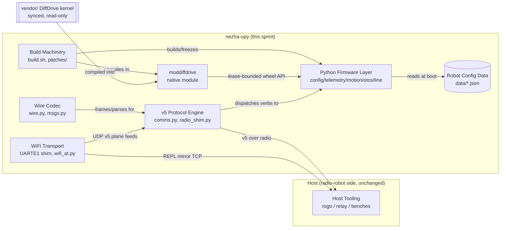
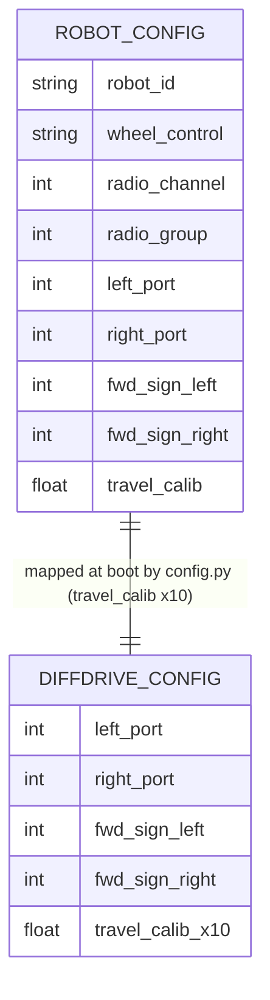
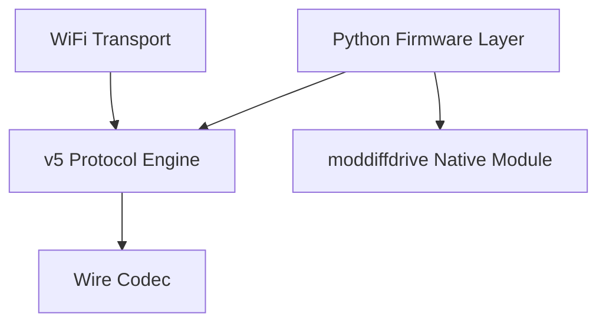

<!-- CLASI: Before changing code or making plans, review the SE process in CLAUDE.md -->

# Sprint 001: Python-first firmware image M0-M6

## Goals

- Bring the nezha-upy image through PLAN.md milestones M0-M6: a bootable
  MicroPython image with the vendored DiffDrive kernel exposed as a
  lease-bounded native module, a byte-compatible v5 wire protocol on
  radio and WiFi, and the full Python firmware layer (config,
  telemetry, motion, otos, line) — every step verified offline.
- Land the two review-driven corrections (`docs/nezha-upy-review.md`,
  incorporated into `docs/design/specification.md` §7) into the M1/M2
  gates: the polling-idiom starvation case plus a visible watchdog
  fault (§7.2), and the mpy-cross-is-lint / manifest-freeze correction
  (§7.4).
- Copy the robot configuration data from radio-robot-elite so
  `config.py` and the bench ladder have real per-robot parameters,
  including the gopiv wiring fix and the tovez bench designation.
- Mark `docs/micropython-full-firmware-in-the-image-gates-3-7.md`
  superseded with a pointer to the specification, closing out the
  review-incorporation issue.
- Keep every ticket's acceptance criteria offline-verifiable; hardware
  acceptance (bench "tovez", radio channel 3, `mbdeploy`) is documented
  as a stakeholder-run procedure, never encoded as a ticket the
  programmer executes.

## Problem

nezha-upy inverts the radio-robot firmware around MicroPython, but at
sprint start only M0's raw materials exist: the repo is seeded,
`build.sh`/`patches/`/`codal_overlay.json` are forked in, and `vendor/`
holds the DiffDrive kernel + Nezha leaf — but the upstream
`micropython-microbit-v2` checkout that `build.sh` expects (`git -C
micropython-microbit-v2 submodule update --init`) is not present
(gitignored, never fetched; confirmed absent during planning), so
`./build.sh --clean` has not yet been proven to produce a hex in this
repo. Nothing above M0 exists: no native module, no wire codec port, no
protocol engine, no WiFi transport, no Python firmware layer, no robot
config data. All four sprint issues are `pending`.

## Solution

Work the milestones in PLAN.md's risk order behind a build-boots gate:
repair/verify the forked build first (M0), then run two independent
offline-only tracks in parallel — robot config data (issue 3) and the
wire codec (M2) — then the highest-risk native module (M1) as soon as
the build is proven, then the protocol engine (M3), the WiFi transport
(M4), and the full Python firmware layer (M5), each gated by an
offline command. Documentation closes the sprint: the supersession
pointer (issue 4) can land any time, and the bench acceptance
procedures + student-facing watchdog contract (M6) are written last,
once the ladder they document actually exists. M7 (additional robots,
color driver) is explicitly deferred.

## Success Criteria

- `./build.sh --clean` produces a hex with flash end < `_fs_start`
  (0x6D000).
- `native/` builds `moddiffdrive` into that hex with the full
  `configure/begin/start/drive/driveDuty/neutral/estop/output/
  lastError` API surface, boot zero-write, VM-hook watchdog (covering
  both the busy-wait and the polling-idiom stall cases, with a visible
  fault bit), and a 5000 ms lease ceiling — verified offline; the three
  hardware legs of the M1 gate become a documented stakeholder
  procedure.
- `tests/` golden-vector suite is 8/8 against the fixture; every binary
  verb round-trips against the host pb2; `mpy-cross` lints every
  `src/*.py` (labelled as a lint per review §4, not a load-path proof).
- `src/comms.py` passes a CPython loopback test against the host's own
  client with byte-exact banner/ack.
- `src/wifi_at.py`'s AT state machine and datagram framing are
  offline-testable against a mock serial/UART.
- `data/` holds the robot config schema plus
  tovez/tovez_nocal/gopiv/togov/active_robot JSON, with the gopiv
  wiring fix and the tovez bench/channel-3 designation present.
- `docs/micropython-full-firmware-in-the-image-gates-3-7.md` carries an
  explicit supersession pointer to `docs/design/specification.md`.
- A bench acceptance procedures document exists covering the full
  hardware ladder (REPL wheel spin -> watchdog/lease/reset triple ->
  `rogo repl <robot> ping` via relay -> `wifi_bench_gate` 9/9 ->
  `move_protocol_bench` full -> M6 sweep) for the stakeholder to run on
  tovez / channel 3 / `mbdeploy`.

## Scope

### In Scope

- PLAN.md milestones M0 through M6.
- Copying (not syncing) robot configuration data from
  radio-robot-elite.
- Marking the superseded gates-3-7 doc with a pointer (issue 4's
  remaining work).
- Offline verification tooling/tests for every milestone.
- Documenting (not executing) the hardware acceptance ladder.

### Out of Scope

- M7 (additional robots, color driver, `radio_bench_gate` over getez).
- Any edit to `vendor/` — kernel changes, including the review's §7.3
  `step()`-restructure exit, happen in radio-robot under
  `src/tests/diffdrive/`, not here.
- radio-robot-side tooling (`sync_upy.py`, `gen_messages.py
  --emit-upy`) — out of scope here; `src/msgs.py` is hand-seeded with a
  `GENERATED — do not edit` header until that lands (spec §10.3).
- Executing any hardware step (flashing, REPL wheel spin,
  `wifi_bench_gate`, `move_protocol_bench`, the M6 sweep) — these are
  stakeholder-run procedures, not ticket acceptance criteria.
- Building a sync mechanism for robot config data — see Design
  Rationale below for why this sprint copies once instead of vendoring.

## Test Strategy

Offline-first, one gate per milestone: `./build.sh --clean` (hex +
flash-end check) for M0 and M1; the golden-vector suite + `mpy-cross`
lint for M2; a CPython loopback harness for M3; mock-serial AT tests
for M4; config-validation unit tests plus the same offline suites for
M5. No suites exist yet in this repo (greenfield); the cross-repo gates
this sprint must not break are radio-robot's `src/tests/diffdrive/`
(untouched — this repo doesn't run it) and this repo's own
vendor-no-edit check (`git diff --exit-code -- vendor/` stays clean
across every ticket). Hardware verification is a stakeholder procedure
documented by the M6 ticket, never part of a ticket's automated
acceptance criteria.

## Architecture

**Sizing: Substantial.** This is the founding sprint for the
repository: it stands up seven new subsystems (a repaired build, a new
native C module, a ported wire codec, a new protocol engine, a new
WiFi transport, a new Python firmware layer, and new robot
configuration data), introduces multiple new cross-module dependencies
between all of them, and adds one data-model element (the robot config
schema, newly present in this repo). All three substantial-tier
signals apply, so this uses the full 7-step methodology with diagrams,
not the compact variant.

### Architecture Overview

**Step 1 — Problem.** Covered above: M0's raw materials exist but
nothing built on them does. `docs/design/specification.md` is
authoritative for what M0-M6 must produce; `docs/nezha-upy-review.md`
(§7 of the spec) corrects two of the milestone gates.

**Step 2 — Responsibilities.** Distinct, independently-changing
responsibilities this sprint introduces:

1. Producing a flashable hex from vendored MicroPython + project
   patches (build/vendoring infrastructure).
2. Exposing the DiffDrive kernel to Python as a safety-bounded API
   (native binding, kernel leaves, I2C arbitration, watchdog).
3. Framing/parsing the v5 wire protocol (pure codec, no dispatch
   logic).
4. Dispatching parsed verbs to firmware handlers under a cooperative
   scheduler (protocol engine).
5. Carrying that same protocol, plus a REPL mirror, over WiFi (a
   second transport, not a second engine).
6. Robot-specific runtime behavior — config load, sensor drivers,
   motion sequencing (the Python firmware layer).
7. Per-robot tuning/wiring data (config data, now data instead of only
   code).
8. Recording how to verify all of the above on hardware, and closing
   out the doc-supersession housekeeping.

These are separated because each changes for different reasons: the
wire codec changes only if the v5 schema changes; the WiFi transport
changes only if AT/module behavior changes; the native module changes
only on kernel-binding concerns, never on protocol concerns.

**Step 3 — Modules.**

| Module | Purpose (one sentence) | Boundary | Use cases |
|---|---|---|---|
| **Build Machinery** (`build.sh`, `codal_overlay.json`, `patches/`) | Produces a flashable micro:bit hex from vendored MicroPython plus this project's patches. | Inside: patch engine, overlay config, build script. Outside: the upstream `micropython-microbit-v2` checkout it fetches (not owned, gitignored) and the module sources it wires in. | UC-001, UC-002 |
| **moddiffdrive Native Module** (`native/`) | Exposes the vendored DiffDrive kernel to Python as a lease-bounded wheel-control API. | Inside: C glue/qstrs, kernel leaves (Clock/Sleeper/Launcher), the I2C broker, boot zero-write, VM-hook watchdog. Outside: `vendor/` kernel source (read-only) and the Python call sites. | UC-002, UC-003, UC-004, UC-005, UC-008, UC-012, UC-015 |
| **Wire Codec** (`src/wire.py`, `src/msgs.py`) | Encodes/decodes v5 protocol frames byte-for-byte compatible with host tooling. | Inside: COBS/CRC framing, generated message structs. Outside: the transport that carries the bytes and the dispatch logic that acts on decoded verbs. | UC-006 |
| **v5 Protocol Engine** (`src/comms.py`, `src/radio_shim.py`) | Dispatches parsed v5 verbs to firmware handlers under a bounded scheduled pump that keeps the REPL live. | Inside: dispatch order, ack ring, telemetry emit policy, radio fragment reassembly. Outside: the wire codec it consumes, the firmware handlers it calls, the WiFi UDP plane that feeds it the same way radio does. | UC-007, UC-008 |
| **WiFi Transport** (native UARTE1 shim + `src/wifi_at.py`) | Carries a REPL mirror and the UDP v5 plane over the module's second UART. | Inside: AT state machine, TCP-REPL stdio hook, UDP datagram coalescing. Outside: the USB REPL (untouched) and the protocol engine (consumes the UDP plane). | UC-009, UC-010 |
| **Python Firmware Layer** (`src/config.py`, `telemetry.py`, `motion.py`, `otos.py`, `line.py`) | Implements the robot's runtime behavior on top of the native and protocol layers. | Inside: these five modules. Outside: moddiffdrive (called), comms.py (calls into this layer), robot config data (read at boot). | UC-011, UC-012, UC-013 |
| **Robot Configuration Data** (`data/`) | Supplies baked-at-boot per-robot tuning and wiring parameters. | Inside: schema + per-robot JSON, copied from radio-robot-elite. Outside: config.py (the only consumer); no live-tuning mechanism exists. | UC-011, UC-002 |
| **Acceptance & Process Docs** (`docs/`) | Documents the offline and hardware verification ladder so the stakeholder can run acceptance without re-deriving it. | Inside: bench procedures doc, supersession pointer, student-facing watchdog/idle contract note. Outside: code itself. | UC-014 |

**Step 4 — Diagrams.**

Component diagram (3+ modules touched, multiple new cross-module
dependencies — required):

Entity-relationship diagram (data-model addition — the robot config
schema is new in this repo):

Dependency graph (new module dependencies being established — required;
checked for cycles):

No cycles; max fan-out is 2 (Python Firmware Layer). Build Machinery and
Robot Configuration Data are intentionally omitted from the dependency
graph — the first is a build-time producer, not a runtime dependency,
and the second is a leaf every runtime module already shows reading in
the component diagram.

Note on dependency direction: Python Firmware Layer → moddiffdrive
looks like domain-depends-on-infrastructure at first read, but the
edge terminates at moddiffdrive's narrow published Python API
(`configure/begin/start/drive/...`), not at its C internals or at
`vendor/`'s kernel — that boundary is exactly the "depend on
interfaces, not implementations" contract, satisfied here by the
native module's Python surface acting as the interface.

**Step 5 — What Changed / Why / Impact / Migration.**

*What changed:* all eight modules above are new — this is a greenfield
repo below the M0 layer. Build Machinery already exists as forked
scaffolding but is unproven (`./build.sh --clean` has not produced a
hex here).

*Why:* PLAN.md's stakeholder-fixed decision (2026-08-18, confirmed
governing 2026-08-19) — MicroPython as the base, DiffDrive kernel
vendored intact, v5 wire byte-compatible, own repository.

*Impact on existing components:* none outside this repo. Inside it,
Build Machinery is the only component with prior state (forked, not yet
verified); everything else is additive. Radio-robot is unaffected —
this sprint touches nothing there and never edits `vendor/`.

*Migration concerns:* see the dedicated section below.

### Design Rationale

**Decision: robot config data is copied once, not vendored/synced.**
*Context:* issue 3 explicitly asks whether the config files should be
vendored (synced like `vendor/`, radio-robot-elite as source of truth)
or copied once. *Alternatives considered:* (a) build a
`sync_configs.py` analogous to `sync_upy.py`, gated by a sync-diff
check, never edited here; (b) copy once into `data/` as regular,
editable source. *Why (b):* radio-robot-elite is a sibling repo with no
existing export tooling for this purpose, and building one is
radio-robot-side/out-of-scope work this sprint explicitly excludes;
more importantly, `config.py`'s fail-closed key validation and the
gopiv wiring-fix landing (M1) mean this repo's copy is expected to
diverge from radio-robot-elite's as the schema evolves here — treating
it as sync-locked, never-edit vendor content would conflict with that.
*Consequences:* `data/` is normal tracked source, not gated by a
sync-diff check; provenance (source path, copy date) is recorded in a
comment/README in `data/` so the one-time origin isn't lost.

**Decision: the v5 protocol engine is transport- and
hardware-decoupled so it is CPython-loopback-testable.** *Context:*
M3's gate requires "comms.py under CPython + loopback vs the host's own
client" before any hardware step. `comms.py` also has to dispatch verbs
like WHEELS into `moddiffdrive`, which is native code with no CPython
equivalent. *Alternatives considered:* couple `comms.py` directly to
`moddiffdrive` calls (rejected — makes the M3 offline gate impossible
under CPython, since the native module can't load there). *Why:*
`comms.py` dispatches through the firmware-layer interface
(`motion.py`/`config.py` call sites), which ticket 007 backs with the
real `moddiffdrive` API and which the CPython loopback test backs with
a stub. *Consequences:* ticket 005 (protocol engine) does not
hard-depend on ticket 004 (native module) for its offline gate; full
on-device WHEELS dispatch is exercised together only at ticket 007 and
the stakeholder's hardware ladder.

**Decision: the M1 fiber-vs-SWI question is deferred to hardware
evidence, not resolved this sprint.** *Context:* review §3 documents a
fully-specified exit (restructure `step()` into a re-entrant state
machine off a pended SWI) if the CODAL-fiber approach's M1 safety
triple reads badly. *Alternatives considered:* pre-emptively build the
SWI restructure now. *Why not:* it is a `vendor/` change (out of
scope — happens in radio-robot under `src/tests/diffdrive/`), and
PLAN.md's own sequencing is explicit: "build M1 as planned, score the
safety triple, decide from evidence." *Consequences:* ticket 004
implements the fiber-based kernel as planned; if the stakeholder's
hardware run of the safety triple (documented in ticket 009) reads
badly, the SWI restructure becomes a radio-robot issue, not a
reopening of this sprint.

**Decision: `manifest.py` freezing lands at M5 stabilization, not
earlier.** *Context:* review §4 — this port cannot load `.mpy` from the
filesystem (`MICROPY_PERSISTENT_CODE_LOAD` is unset), so the M2
mpy-cross gate is a lint only; real module shipping is
`manifest.py` freezing. *Why deferred:* freezing costs a
rebuild+reflash per Python change, which would slow M2-M4 development
where the filesystem path is faster to iterate on. *Consequences:*
tickets 003-006 develop against the filesystem; ticket 007 (M5) adds
the `manifest.py` freeze entries for every `src/*.py` module (including
`wifi_at.py` from ticket 006) as part of stabilization, and the M6
RAM/flash checkpoint (ticket 009's documented procedure) measures the
resulting heap delta.

### Revision (2026-08-19, post-ticket-009 grounding pass)

Ticket 009's grounding pass surfaced a missed seam: tickets 004-007
each built one milestone's piece (native module, wire codec, protocol
engine, WiFi transport, Python firmware layer) but none of them owned
**assembling those pieces at power-on**. Nothing wired
`config.load_robot_config()` → `diffdrive.configure/begin/start` →
`comms.Comms` → transports (`radio_shim`; `wifi_at` when
`wifi_secrets.json` is present) → `comms.PumpTimer` into a running
image, and the pump's timer source was left unwired — so
`docs/bench-acceptance-procedures.md` §A.3 required manual REPL
assembly every bench session instead of the image simply booting into
the engine, as `specification.md` §5/§6 (M3's banner/boot/READY
sequence, M5's fail-closed boot test) already implies.

Added a ninth module to Step 3's table:

| Module | Purpose (one sentence) | Boundary | Use cases |
|---|---|---|---|
| **Boot Wiring** (frozen boot module, e.g. `src/main.py`) | Assembles the Python Firmware Layer, protocol engine, and transports into a running image at power-on. | Inside: the ordered boot sequence (config load → diffdrive arm → comms/transport bring-up → pump start → banner/READY) and the fail-closed/no-secrets branching. Outside: the modules it assembles (calls their existing published interfaces only; owns no protocol, drive, or transport logic itself). | UC-002, UC-011, UC-007 |

This module sits atop the dependency graph (depends on Python Firmware
Layer, v5 Protocol Engine, and — when secrets are present — WiFi
Transport; nothing depends on it) and does not change the graph's
acyclic shape or any existing module's boundary. It is additive: no
other module's purpose, boundary, or interface changes. Delivered by
ticket 010 (depends on 007, the last piece it assembles).

### Migration Concerns

None in the backward-compatibility sense — this is a greenfield repo
with no prior release. The two concerns that function like migration
concerns:

- **Freeze-point tradeoff:** switching module loading from filesystem
  (fast iteration, M2-M4) to `manifest.py` freezing (M5) is a one-way
  step within the sprint — once frozen, further Python changes need a
  full rebuild+reflash. Ticket 007 is the only ticket that should
  perform this switch.
- **Config data provenance:** `data/` is copied once from
  radio-robot-elite (see Design Rationale). If radio-robot-elite's
  configs change after this sprint, this repo's copy will silently
  drift — acceptable per the decision above, but worth a one-line note
  in `data/README.md` (ticket 002) so a future maintainer knows it's
  not auto-synced.

### Open Questions

- **Teaching-framework loop ownership** (`on_tick()` callbacks vs.
  student `while True:`) — spec open item 4, explicitly "decide before
  M5." Ticket 007 must either make this call or escalate it to the
  stakeholder before implementing `motion.py`'s API surface; it is not
  pre-decided by this sprint plan.
- **`VER`/`ID` string value** — spec open item 1: format is frozen, but
  the version value identifying the upy build is undecided. Flag if any
  host tool is found to pin the old value; non-blocking for this
  sprint.
- **M1 fiber-vs-SWI** — see Design Rationale; explicitly deferred to
  hardware evidence gathered by the stakeholder (ticket 009's
  procedure), not a question this sprint resolves.
- **Local build prerequisites** — `micropython-microbit-v2` is not yet
  present locally (gitignored, fetched by `build.sh`) and the `intelhex`
  Python package (required by `addlayouttable.py`) was not found in the
  planning environment. Ticket 001 must establish both as part of
  making `./build.sh --clean` succeed; this is implementation work, not
  a stakeholder decision.

## Use Cases

This sprint implements the full use-case set in
`docs/design/usecases.md` (UC-001 through UC-015) — it is the sprint
that builds M0-M6 in their entirety, so rather than duplicate those
use cases here, this section maps each to the ticket(s) that deliver
it.

| UC | Title | Actor | Delivered by | Milestone |
|---|---|---|---|---|
| UC-001 | Build the image | Developer | 001 | M0 |
| UC-002 | Flash and boot to a live REPL | Developer/Stakeholder | 001, 004, 009, 010 | M0/M1 |
| UC-003 | Student drives wheels from the REPL | Student | 004, 009 | M1 |
| UC-004 | Starvation watchdog protects a blocked student loop | Student | 004, 009 | M1 |
| UC-005 | Reset mid-drive is silenced by boot zero-write | Student/Developer | 004, 009 | M1 |
| UC-006 | Wire codec round-trips the golden vectors | Developer | 003 | M2 |
| UC-007 | Host tooling pings the robot through the relay, unchanged | Wire client | 005, 009, 010 | M3 |
| UC-008 | Motion command over radio produces motion and acks | Wire client | 004, 005, 009 | M1/M3 |
| UC-009 | WiFi REPL mirror session | Student/Developer | 006, 009 | M4 |
| UC-010 | UDP v5 plane on WiFi | Wire client | 006, 009 | M4 |
| UC-011 | Robot config loads fail-closed at boot | Developer/Student | 002, 007, 010 | M0/M5 |
| UC-012 | Telemetry stream | Wire client | 004, 007, 009 | M1/M5 |
| UC-013 | Queued motion sequencing | Wire client/Student | 007, 009 | M5 |
| UC-014 | Stakeholder acceptance sweep (M6) | Stakeholder | 009 | M6 |
| UC-015 | Vendor sync stays clean | Developer | 004 (gated every ticket) | cross-cutting |

Ticket 008 (marking the superseded gates-3-7 doc) is process/documentation
housekeeping that directly implements issue 4; `usecases.md` does not
model doc-authority housekeeping as a use case, so 008 is a stated
exception to "every ticket traces to a UC" — it traces to issue 4
instead.

## GitHub Issues

(None — this sprint's issues are CLASI-local `clasi/issues/` files, not
GitHub issues.)

## Definition of Ready

Before tickets can be created, all of the following must be true:

- [x] Sprint planning document is complete (sprint.md, including its
      Architecture and Use Cases sections)
- [x] Architecture review passed (or skipped, for changes with no
      architectural impact)
- [x] Stakeholder has approved the sprint plan (approved 2026-08-19 to
      proceed autonomously)

## Tickets

| # | Title | Depends On |
|---|-------|------------|
| 001 | Build boots offline gate (M0) | — |
| 002 | Copy robot config data + wiring fix + schema | — |
| 003 | Wire codec + msgs.py + golden-vector suite (M2) | — |
| 004 | moddiffdrive native module (M1) | 001 |
| 005 | v5 protocol engine: comms.py + radio_shim.py (M3) | 003 |
| 006 | WiFi transport: UARTE1 shim + wifi_at.py + UDP plane (M4) | 001, 005 |
| 007 | Python firmware layer: config/telemetry/motion/otos/line (M5) | 002, 004, 005, 006 |
| 008 | Supersede the gates-3-7 doc with a pointer | — |
| 009 | Bench acceptance procedures + student-facing API contract (M6) | 004, 006, 007 |
| 010 | Boot wiring: assemble the firmware layer at power-on | 007 |

Tickets execute serially in the order listed. 001/002/003/008 have no
dependencies on each other and could run in any relative order within
that constraint; the table lists them first because they unblock
everything else. Ticket 010 was added post-hoc (2026-08-19, after
009's grounding pass surfaced the boot-wiring gap — see the
Architecture section's Revision note); it depends only on 007 and was
immediately runnable since 001-009 were already done when it was
created.
